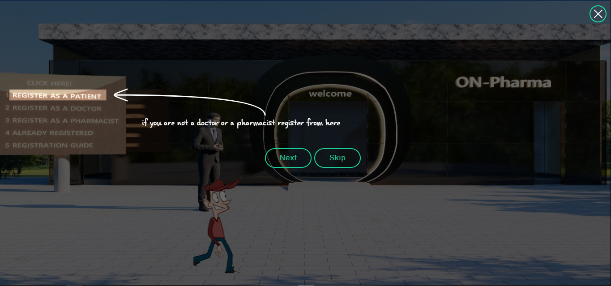
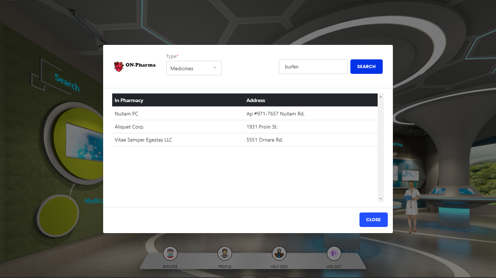
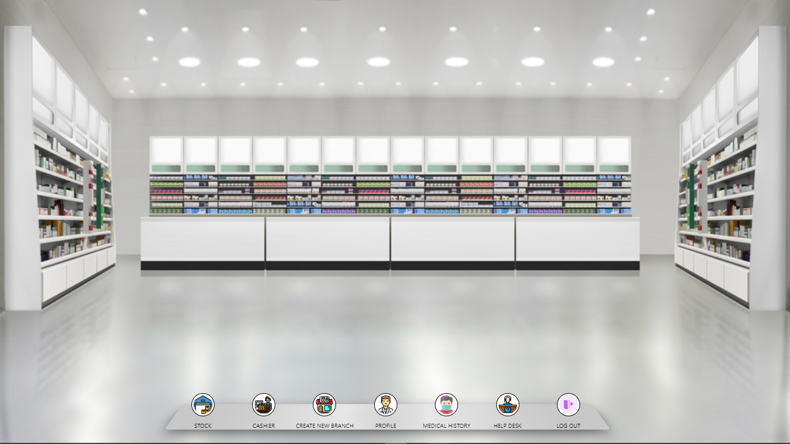

    ON-Pharma ... The First Virtual Online Care

Home Screen
-----------------------

Doctor's View
-----------------------

Search For Medicines
-----------------------

Medical History
-----------------------

View Your Pharmacy
-----------------------

Cashier Of Pharmacy
-----------------------

To Run The Code, Install
----------------------------
    NodeJS

Then, In Terminal Write 
----------------------------
    npm i

Then, Replace Script Object In The Package.json File With This Object
-------------------------------------------------------------------------
    "scripts": {
        "test": "echo \"Error: no test specified\" && exit 1",
        "start": "npx nodemon app.js"
    },

Then, In The Terminal Wirte
-----------------------------
    npm start

Now, App Is Running! Write This Line In The Search Field Of Your Browser To enjoy Our Virtual Online Care
--------------------------------------------------------------------------------------------------------------
    localhost:3000/home

Or Just Visit Our Website for full experience try it from PC
----------------------------
    https://online-care-p.herokuapp.com/home
    

