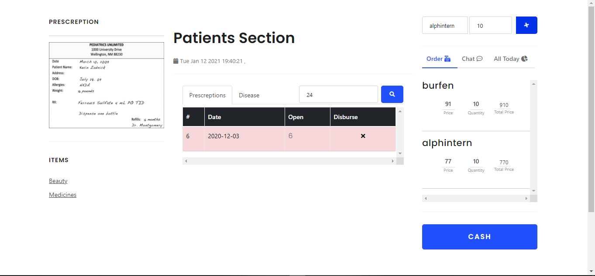

# 📙 Description
Patients and their relatives from all over the world suffer from the problem of visiting doctors and having to hold all the patient's previous prescriptions, scans and analysis or more often having to memorize all the patient's medical records and allergies. 
ONpharma presents a solution for these problems by holding all these stuff for them in a fully structured form. Moreover, it presents a searching tool to ease the process of searching for medicines in nearby pharmacies. 
ONpharma establishes a secure connection between the patient and the doctor and allows the doctor to directly access and view patient's medical history to provide a professional examination process for both sides. 
ONpharma can also be used by pharmacists to 
better control and manage pharmacies by showing current medicines in the stock, directly access patient's prescription, handling cash and a lot more.

    ON-Pharma ... The First Virtual Online Care

💻 Built Using
--------------------
   * MYSQL
   * Nodejs
   * Express
   * HTML
   * Ajax
   * Jquery
   * Bootstrap

Home Screen
-----------------------

Doctor's View
-----------------------

Search For Medicines
-----------------------

Medical History
-----------------------

View Your Pharmacy
-----------------------

Cashier Of Pharmacy
-----------------------

To Run The Code, Install
----------------------------
    NodeJS

Then, In Terminal Write 
----------------------------
    npm i

Then, Replace Script Object In The Package.json File With This Object
-------------------------------------------------------------------------
    "scripts": {
        "test": "echo \"Error: no test specified\" && exit 1",
        "start": "npx nodemon app.js"
    },

Then, In The Terminal Wirte
-----------------------------
    npm start

Now, App Is Running! Write This Line In The Search Field Of Your Browser To enjoy Our Virtual Online Care
--------------------------------------------------------------------------------------------------------------
    localhost:3000/home

Or Just Visit Our Website for full experience try it from PC
----------------------------
    https://online-care-p.herokuapp.com/home
    

